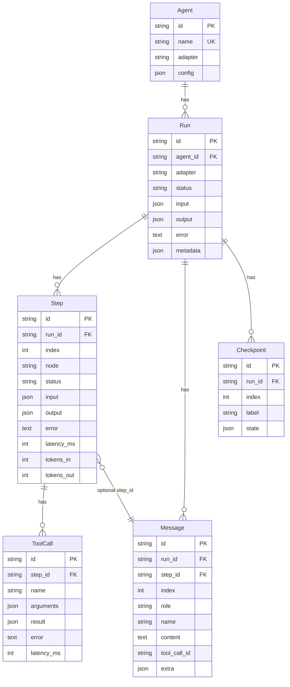
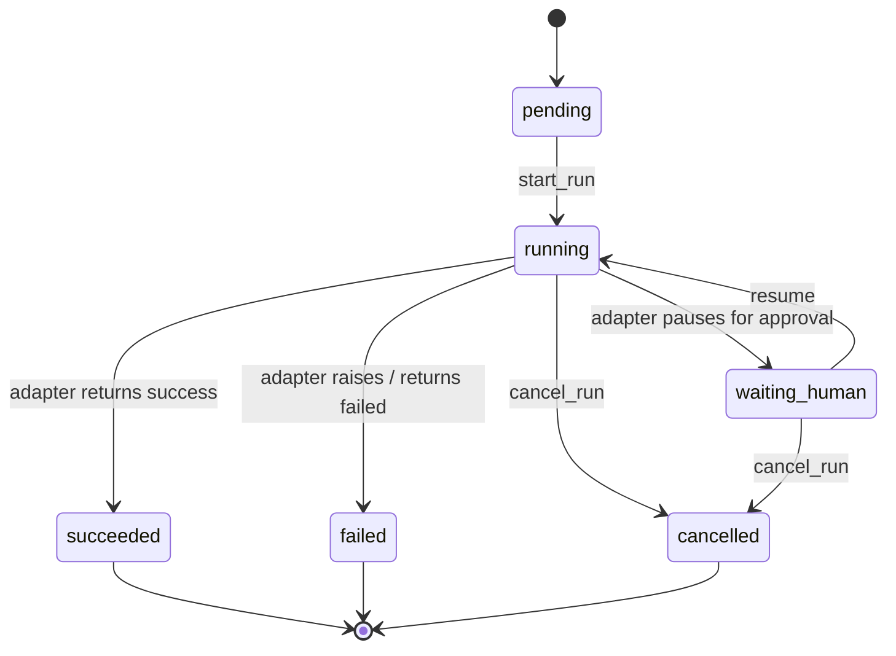

# Data model

AgentFlow stores every adapter execution in a small set of tables. The shape
is deliberately framework-agnostic so a single UI and SDK can render any
agent system.

## Entities

## Status state machine

## Design notes

- **IDs are ULIDs** (26-character strings). They are sortable by time, easy
  to log, and safer than auto-increment ids when the runtime fans out to
  multiple workers.
- **`metadata` is a JSON column** named `metadata_` in Python because
  `metadata` is reserved on `DeclarativeBase`. The column on disk is still
  `metadata`.
- **`Checkpoint.state` is opaque to the runtime.** Each adapter decides how
  to encode resumable state (LangGraph snapshot bytes encoded as JSON,
  AutoGen conversation, custom state machines).
- **`Step.index` is monotonic per run.** Use it for ordering instead of
  `created_at` so retries and replays stay stable.
- **`Message.step_id` is optional** so an adapter can attach a message to a
  specific node tick when it makes sense, while keeping the run-level
  ordering authoritative.

## Indexes

| Index | Purpose |
| --- | --- |
| `ix_runs_status` | filter pending / running runs from a worker |
| `ix_runs_agent_id` | list runs for an agent |
| `ix_steps_run_index` | render the step timeline in O(log n) |
| `ix_messages_run_index` | stream messages in order |
| `ix_tool_calls_step` | render tool calls inside a step |
| `ix_checkpoints_run_index` | replay from the latest checkpoint |
